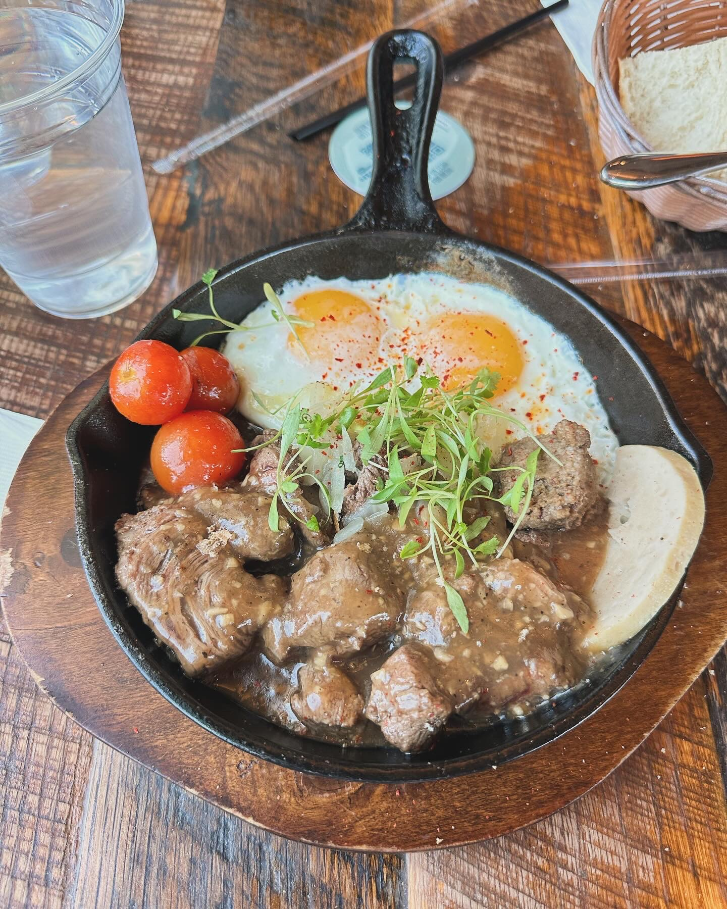
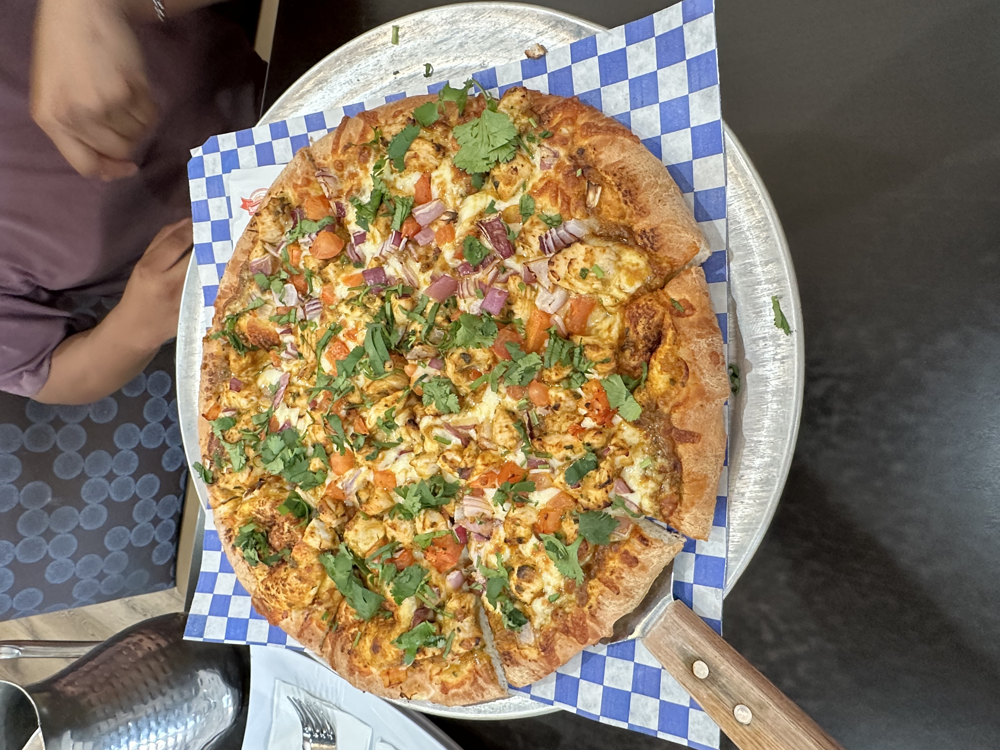
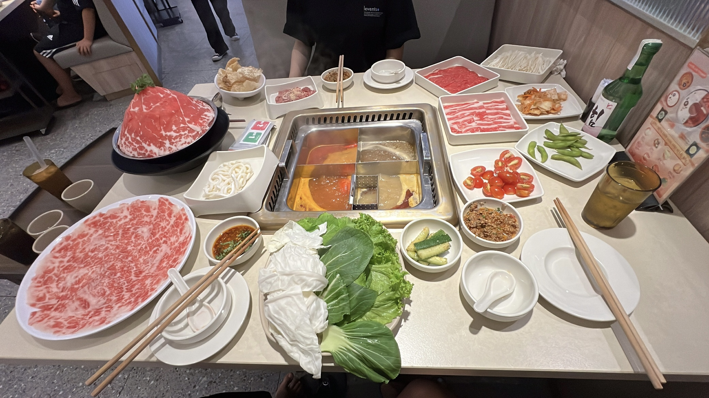
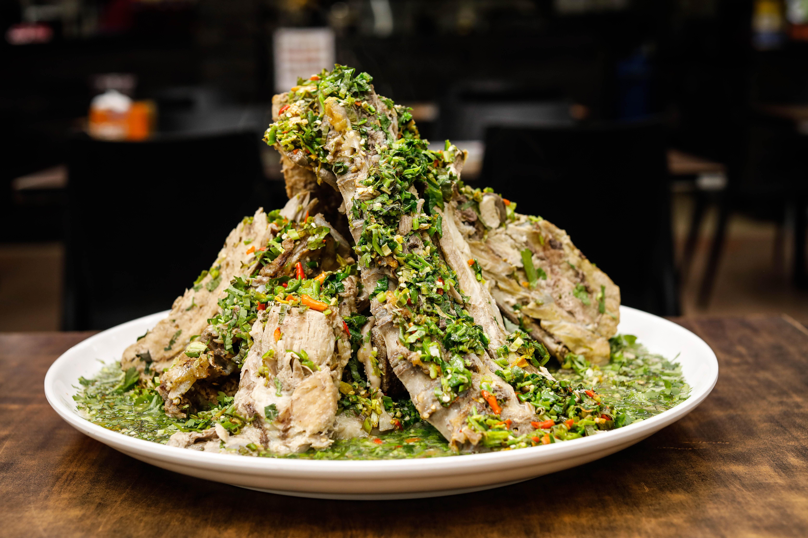

# CSE 110 Software Engineering

## About Me

I'm a transfer student from Palomar College, and this is my third year studying CS. I'm currently working under the ERSP program, supporting a PhD student with her research project. You can check out more about my coding experience and skills [here](#some-projects-ive-worked-on).

Besides coding, I enjoy cooking and eating. I love trying out new restaurants and activities around San Diego.

> Good food is the foundation of genuine happiness.

Below are a few foods that I've tried around _San Diego_ and _Orange County_.

This place is called [Nep](https://www.nepcafe.com/).
If you love Asian food, specifically Vietnamese food, you should try this place. They offer unique dishes that you can't find at most Vietnamese restaurants.

They have 2 locations in Orange County:

- Fountain Valley
- Irvine

This is something new that I tried. An Indian curry pizza. It sounds crazy, right? I never thought of turning curry into a pizza before, but it's definitely worth trying at least once. You never know if you'll like it, and I actually really enjoyed it!
This place is called _Paradise Biryani Pointe_ located in Mira Mesa.

I love hot pot, any kind, but especially spicy. Out of everything, I think I eat hot pot the most. It's always my go to spot no matter the occasion. Whether I'm happy, sad, tired, or excited to celebrate the end of each quarter!

Something that I recently wanted to try out is a Thai dish called Leng Saap.

This is spicy pork bone boiled in some kind of broth. I have found a place in San Diego that have this dish. However, they only offer it certain time of the year not a permanent dish on a menu 😭.

## **Classes I have taken at UCSD**

1. CSE 21
2. CSE 29
3. CSE 100
4. CSE 193
5. CSE 198

## **Classes I'm currently taking at UCSD**

1. CSE 101
2. CSE 110
3. CSE 150B

## Some Projects I've Worked On

Here's a little bit about my skills and the projects I've been or currently working on.

### ERSP Research — AI and Human Perception

I'm currently an ERSP student working on a research project exploring AI and human perception. The project dives into questions like:

- How do beauty filters change not just our appearance, but how AI models interpret us?
- How much are we trusting these AI systems to make decisions for us?

### Personal Project — AI Caption Generator

I'm also working on a personal project related to one of my interests: using AI to generate social media captions for images.

I love posting pictures of random things I capture just to keep memories. However, I often find it difficult to come up with a good caption. So I thought why not build an AI agent that generates captions for my images? It's a great way to apply everything I've learned in school along with my own personal exploration.

I'm currently building the backend using `Express` and connecting to an external API, with `CORS` middleware to handle communication between the frontend and server.

## Things I Want to Do Before Fall 26 Starts

- [ ] Eat Leng Saap
- [ ] Finish the AI Caption Generator
- [ ] Try to make at least one of these saved [shrimp recipes](shrimprecipe.jpg)
